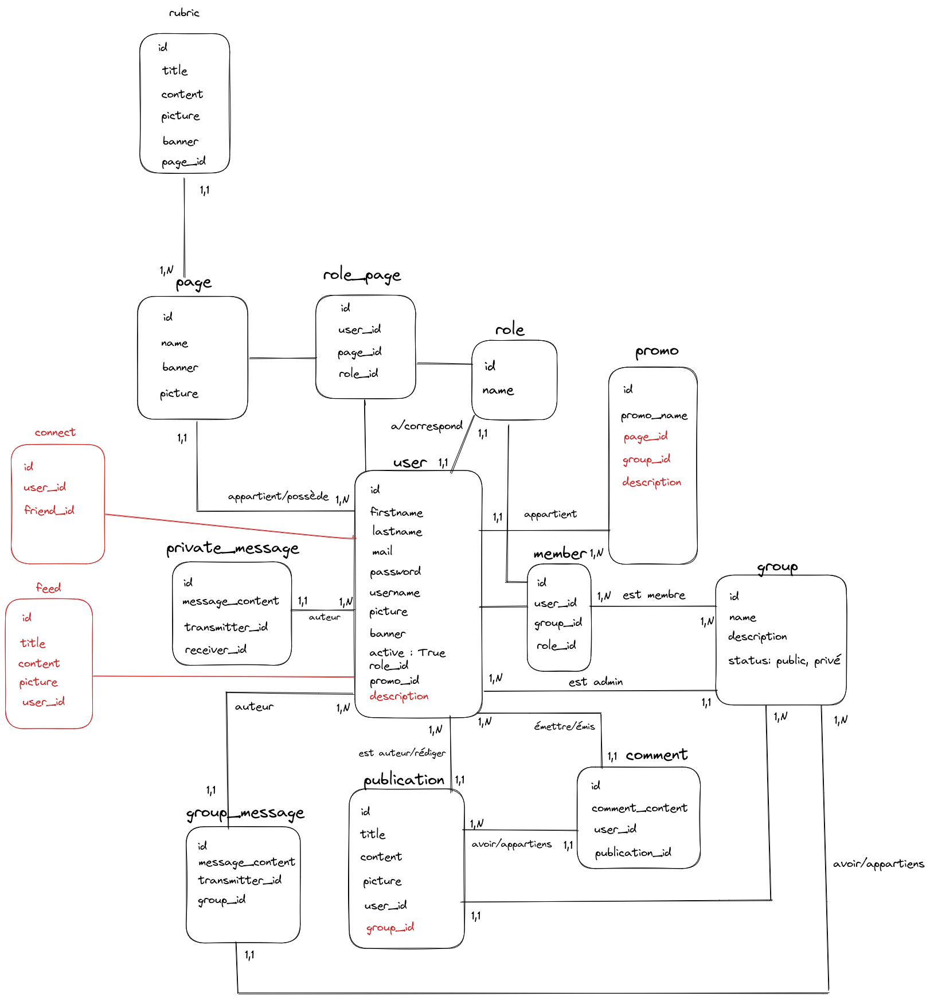

# MCD

# Controllers

# rubricController => Gérer la table rubric

|Methodes| url | controllers |commentaires|
|--------|-------------|-------------|------------|
| GET  | /rubric/:id | rubricController | récupérer toute les rubriques d'une page |
| POST  | /addRubric/:id_page | rubricController | ajouter une rubric sur une page |
| POST | /deleteRubric/:id | rubricController | supprimer une rubric |
| POST | /updateRubric/:id | rubricController | modifier une rubric |

# pageController => gérer la table page

|Methodes| url | controllers |commentaires|
|--------|-----|-------------|------------|
| GET | /getPage/:id | pageController | afficher la page d'un utilisateur |
| POST | /addPage | pageController | créer une page |
| POST | /modifyPage/:id_user | pageController | modifier le contenu d'une page |
| POST | /deletePage/:id_user | pageController | supprimer une page |

# groupController => gérer les groupes

|Methodes| url | controllers |commentaires|
|--------|-----|-------------|------------|
| POST | /groups/create | groupController | Créer un groupe public ou privé |
| POST | /groups/join | groupController | S'inscrire à un groupe public |
| POST | /groups/apply | groupController | Candidater à un groupe privé |
| GET  | /group/publications/:id_group | groupController | Voir les publications d'un groupe pour les membres du groupe|
| POST | /groups/invite | groupController | Inviter ses relations au groupe |
| POST | /groups/approve/:id_user | groupController | Accepter ou refuser les candidatures à un groupe privé si l'utilisateur est admin |
| POST | /groups/modifyUserRights/:id_user | groupController | Changer les droits d'un utilisateur si admin (admin/membre) |
| POST | /groups/removeUser/:id_user | groupController |Si admin exclure un membre d'un groupe |
| POST | /groups/modifyInfo/:id_admin | groupController | Si admin changer les informations du groupe (nom, description, image) |

# roleController => gérer les rôles des utilisateurs 

|Methodes| url | controllers |commentaires|
|--------|-----|-------------|------------|
| POST | /updateRole/:id_user | roleController | si le user est admin modifier un rôle |
| POST | /deleteRole/:id_supert_admin | roleController | si le user est admin supprimer un rôle |
| POST | /addRole/:id_supert_admin  | roleController | si le user est suppert admin ajoute un rôle |

# promoController => gérer les promos

|Methodes| url | controllers |commentaires|
|--------|-----|-------------|------------|
| GET  | /getPromo | promoController | afficher toute les promos |
| GET  | /getPromo/:id | promoController | afficher le détail d'une promo, lorsque l'on clique sur une promo avec la liste des élève |
| POST | /addPromo/:id_supert_admin | promoController | ajouter une promo |
| POST | /delectPromo/:id_supert_admin | promoController | supprimer une promo |
| POST | /updatePromo/:id_supert_admin | promoController | mettre à jour une promo |

# commentController => gérer les commentaires d'une publication 

|Methodes| url | controllers |commentaires|
|--------|-----|-------------|------------|
| GET | /getAllComments/:id_publication | commentController | récupérer les commentaires d'une publication |
| POST  | /addComment/:id_publication |  commentController | ajouter un commentaire sur une pubpication
| POST | /updateComment/:id/:id_user | commentController | si autheur du commentaire modifier le commentaire |
| POST | /deleteComment/:id/:id_user | commentController | si autheur ou admin Supprimer un commentaire |

# messageController => gérer les messages privé et public entre utilisateurs

|Methodes| url | controllers |commentaires|
|--------|-----|-------------|------------|
| POST |   /message/:id_Receiver/:id_Transmitter/ | messageController  | envoyer un message privé |
| GET  | /message/:id_Receiver/:id_Transmitter/  |  messageController  | recevoir et afficher un message privé reçu # ?|
| POST | /updateMessage/:id/:id_transmitter | messageController | si auteur du message modifier un message |
| POST | /deleteMessage/:id/:id_user | messageController | si auteur ou receveur du message supprimer un message |

# userController => gérer les utilisateurs

|Methodes| url | controllers |commentaires|
|--------|-----|-------------|------------|
| POST | /profile/update | userController | Modifier ses informations personnelles |
| POST | /profile/deactivate | userController | Désactiver son compte |
| POST | /profile/reactivate | userController | Réactiver son compte |
| POST | /profile/delete | userController | Supprimer son compte |
| POST | /signup | userController | Créer un compte |
| POST | /login | userController | Se connecter |
| POST | /logout | userController | Se déconnecter|
| GET | /relation/search/:params | connectController | rechercher une relation||l

# feedController => gérer le contenu d'un user

|Methodes| url | controllers |commentaires|
|--------|-----|-------------|------------|
| GET | /feeds/:id_user | feedController | toute les publications d'un user |
| POST | /addFeed/:id_user | feedController | ajouter le feed d'un user |
| POST | /deleteFeed/:id | feedController | supprimer le feed d'un user |
| POST | /updateFeed/:id | feedController | mettre a jour le feed d'un user |

# connectController => gérer les connexions entre user

|Methodes| url | controllers |commentaires|
|--------|-----|-------------|------------|
| GET | /relation/:id_user  | connectController | afficher toutes ses relations d'un user |
| POST | /relation/add/:id_user | connectController | ajouter un user comme relation |
| POST | /relation/delete/:id | connectController | supprimer une relation |

# publicationController => gérer les publications

|Methodes| url | controllers |commentaires|
|--------|-----|-------------|------------|
| POST  | /sendPublication/:id_group | publicationController | publier la publication dans un groupe |
| GET  | /getPublication/:id | publicationController | afficher la publication |
| POST | /updatePublication/:id | publicationController | modifier la publication |
|  POST  | /deletePublication/:id | publicationController | supprimer la publication |
| GET  | /getPublication | publicationController | afficher les publications | 

# memberController => gérer les membres

|Methodes| url | controllers |commentaires|
|--------|-----|-------------|------------|
| POST | /joinGroup/:id_user/:id_group | memberController | rejoindre un groupe |
| POST | /quitGroup/:id_user | memberController | Quitter un groupe |

